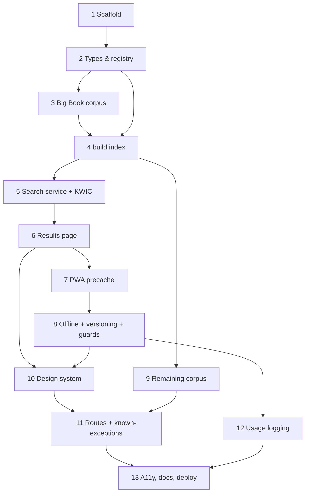

# basictexts.org — Implementation Plan

**Companion to:** [basic-texts-PRD.md](basic-texts-PRD.md) (single source of truth)
**Companion to:** [../../corpus/CORPUS-GUIDE.md](../../corpus/CORPUS-GUIDE.md) (corpus sourcing & ingestion)
**Last updated:** 2026-06-28

This plan breaks the v1 MVP into **logical units of work (LUW)**. Each unit lists its goal, deliverables, dependencies, acceptance criteria, and a **suggested LLM** for implementation.

> **Architecture in one line:** SvelteKit PWA on Cloudflare Pages. Corpus JSON in repo → prebuilt `minisearch` index → client-side search (works offline). The only server code is a thin `/api/log` Pages Function for anonymous usage logging. No D1, no server-side search.

---

## How to read this plan

- **LUWs are ordered by dependency.** Later units assume earlier ones exist.
- **Suggested LLM** reflects task complexity:
  - **Claude Sonnet 4.6** — preferred default for design-sensitive, multi-file, or architecturally-load-bearing work (search engine, copyright gates, PWA/offline, accessibility).
  - **MAI-Code-1-Flash** — preferred for well-specified, mechanical, or repetitive work (scaffolding, static UI from a known design, data-shaping scripts, copy-editing).
- The **0. Service Setup** section is your manual checklist; everything else is buildable by an agent.

---

## 0. Service Setup (manual — your to-do list)

These require your accounts/credentials and cannot be done by an agent. Do them as you reach the phases that need them.

| # | Task | When needed | Notes |
|---|---|---|---|
| 0.1 | **Cloudflare account** (free tier) | Before first deploy (LUW 13) | You already registered `basictexts.org` at Cloudflare Registrar ✓ |
| 0.2 | **Create a Cloudflare Pages project**, connect it to the GitHub repo | LUW 13 | Build command `npm run build`; output dir `.svelte-kit/cloudflare` (adapter-cloudflare). Auto-deploy on push to `main`; preview deploys on PRs. |
| 0.3 | **Point `basictexts.org` DNS at the Pages project** | LUW 13 | Add the custom domain in Pages → Custom domains. Cloudflare handles the cert. |
| 0.4 | **Create a Cloudflare KV namespace** (e.g. `SEARCH_LOG`) | LUW 12 (logging) | Bind it to the Pages project as `SEARCH_LOG`. Free tier is ample. |
| 0.5 | **Decide repo owner/name** and make the GitHub repo public | LUW 13 / README | Update `github.com/[owner]/basictexts` placeholders. |
| 0.6 | **(Optional) Ko-fi + GitHub Sponsors accounts** | Anytime before launch | Reserved space exists in About (LUW 11); placeholder links are fine until ready. |
| 0.7 | **Email AAWS** (`ippolicy@aa.org`) re: Daily Reflections concordance use | Before shipping DR (LUW 9) | Blocking for DR only. App can launch without DR. Reference 164andMore precedent. |
| 0.8 | **Verify 12&12 / Traditions copyright** per CORPUS-GUIDE | Before LUW 9 | If unverified, 12&12 ships as `snippet` (already the default). |

---

## Phase 1 — Foundation: data + search core

### LUW 1 — Project scaffold
**Goal:** A running SvelteKit + TypeScript + Tailwind app with the Cloudflare adapter and PWA plugin wired but empty.
**Deliverables:**
- SvelteKit (TS) project at repo root (alongside `corpus/`, `proto/`, `docs/`)
- TailwindCSS configured with `darkMode: 'class'` and the §8.2 color tokens
- `@sveltejs/adapter-cloudflare` + `@vite-pwa/sveltekit` installed and configured (manifest stub only)
- `lucide-svelte`, `minisearch` installed
- Base layout, `app.css` with design tokens + `.sr-only` utility + `prefers-reduced-motion` handling
- Scripts: `dev`, `build`, `preview`, `lint`, `check`
**Depends on:** —
**Acceptance:** `npm run dev` serves a blank styled shell; `npm run build` succeeds with the Cloudflare adapter.
**Suggested LLM:** **MAI-Code-1-Flash** (well-trodden scaffolding).

### LUW 2 — Domain types & registry loading
**Goal:** Typed data model and a loader for the source registry.
**Deliverables:**
- `src/lib/types.ts`: `Source`, `Passage`, `SearchResult`, `GroupedResults`, `LogRecord`, `KnownException`, `DisplayMode` (matching PRD §6)
- `src/lib/corpus/registry.ts`: loads/validates `sources.json`, exposes enabled sources sorted by `sortOrder`
- Copy the prototype's `sources.json` shape as a starting point; correct it to PRD §6.4 (add `twelve-traditions`; DR `linkTemplate` = static aa.org URL)
**Depends on:** LUW 1
**Acceptance:** Types compile; a unit test loads the registry and returns sources in order.
**Suggested LLM:** **Claude Sonnet 4.6** (types are load-bearing across the app).

### LUW 3 — Big Book corpus ingestion (data prep)
**Goal:** The 1st-edition Big Book as a clean corpus file with **frozen, stable passage IDs**.
**Deliverables:**
- `corpus/sources/big-book-1ed.json` per CORPUS-GUIDE Part 3 (chapters, foreword, Doctor's Opinion, Dr. Bob's story, Spiritual Experience appendix)
- Stable ID scheme implemented and documented: `bb1-<pageRef>-p<paraIndex>` (e.g. `bb1-p58-p2`). IDs are frozen once published.
- Validation: confirm it's the **1st edition** (no 3rd-ed additions; exclude the "Acceptance" personal story)
**Depends on:** LUW 2; CORPUS-GUIDE
**Acceptance:** `corpus/scripts/validate.js` passes; spot-check known passages (e.g. "How It Works", p.58–60) resolve to correct IDs.
**Suggested LLM:** **Claude Sonnet 4.6** (judgement on edition correctness + ID scheme is a forever-contract).

### LUW 4 — Prebuilt index build script
**Goal:** `npm run build:index` compiles corpus → static index assets (PRD §7.2).
**Deliverables:**
- `corpus/scripts/build-index.mjs`: reads registry + corpus files, builds a deterministic `minisearch` index, emits `static/index/minisearch.json`, `static/index/passages.json`, `static/index/index-meta.json` (content-hash `version`)
- `corpus/scripts/validate.js`: schema + referential-integrity checks (PRD §6.5)
- Wire `build:index` into `npm run build`
**Depends on:** LUW 2, LUW 3
**Acceptance:** Running the script on the Big Book emits all three files; re-running with unchanged input produces an identical `version` hash (determinism).
**Suggested LLM:** **Claude Sonnet 4.6** (determinism + hashing correctness matter).

### LUW 5 — Client search service + KWIC/highlight
**Goal:** Client-side search with display-mode-correct KWIC and highlighting.
**Deliverables:**
- `src/lib/search/index.ts`: hydrate `minisearch` from `static/index/`, run keyword (AND) + quoted-phrase queries, group by source, 150ms debounce
- `src/lib/search/kwic.ts`: per-`displayMode` clipping (`full-text` = whole; `snippet`/`concordance-only` = `contextWords` each side + `...`); HTML-escape-then-`<mark>` with accessible `sr-only` labels (PRD §8.4)
- Svelte store holding the loaded index/passages
- Unit tests for: phrase vs keyword, display-mode clipping, highlight escaping (XSS), AND logic
**Depends on:** LUW 4
**Acceptance:** Tests pass; searching "fear" returns grouped Big Book results with correct highlights; `concordance-only` never yields full text.
**Suggested LLM:** **Claude Sonnet 4.6** (core engine + copyright gate + security).

### LUW 6 — Functional search results page
**Goal:** A working (unstyled-ish) search page proving the pipeline end-to-end.
**Deliverables:**
- `/` route: search input, results grouped by source with counts, KWIC cards
- URL sync (`?q=`)
**Depends on:** LUW 5
**Acceptance:** Typing a query updates results and the URL; reload restores the query.
**Suggested LLM:** **MAI-Code-1-Flash** (straightforward wiring on top of the tested service).

---

## Phase 2 — PWA & Offline

### LUW 7 — PWA manifest, icons, precache
**Goal:** Installable PWA that precaches the app shell and index.
**Deliverables:**
- `@vite-pwa/sveltekit` config: manifest (name, theme `#2C4A6E`, bg `#F8F7F4`, standalone), real 192/512 icons (replace prototype's SVG-data-URI hack with proper PNGs)
- Workbox precache for app shell + `static/index/*`
**Depends on:** LUW 6
**Acceptance:** Lighthouse PWA install criteria pass; app installs to home screen.
**Suggested LLM:** **MAI-Code-1-Flash** (config-driven, well-documented plugin).

### LUW 8 — Offline behavior, versioning & link guards
**Goal:** Full offline search + graceful online-only degradation + cache-busting.
**Deliverables:**
- Startup index-version check vs `index-meta.json` (network-first, tiny) with "Updated library available — refresh" affordance (PRD §7.6)
- `online`/`offline` store + nav badge (green/Wifi vs amber/WifiOff+pulse)
- Online-only link guard: intercept external links when offline, show "You're offline — this link needs an internet connection" (PRD §7.5)
**Depends on:** LUW 7
**Acceptance:** DevTools → Offline: search still works; external links warn instead of dead-navigating; a bumped `version` triggers the refresh affordance.
**Suggested LLM:** **Claude Sonnet 4.6** (offline edge cases are subtle).

---

## Phase 3 — Full Corpus & UI

### LUW 9 — Remaining v1 corpus
**Goal:** Ingest 12&12 (`snippet`), Twelve Traditions, and Daily Reflections (`concordance-only`, if unblocked).
**Deliverables:**
- `corpus/sources/twelve-steps-traditions.json` (`snippet`; web-search passthrough link `https://www.google.com/search?q=aa+12x12+{{query}}` + purchase link)
- `corpus/sources/twelve-traditions.json` (short list; `full-text` if PD-confirmed, else `snippet`)
- `corpus/sources/daily-reflections.json` (366 entries; `concordance-only`; static aa.org link) — **only if LUW 0.7 resolved**; otherwise ship with `enabled: false`
- Rebuild index
**Depends on:** LUW 4; LUW 0.7/0.8; CORPUS-GUIDE
**Acceptance:** Validation passes; `snippet`/`concordance-only` render clipped only; DR (if enabled) never renders full text.
**Suggested LLM:** **Claude Sonnet 4.6** (copyright-mode correctness per source).

### LUW 10 — Design system applied to search + nav + theme
**Goal:** The polished UI from §8.2–8.4 (the "good" from the prototype), as Svelte components.
**Deliverables:**
- Navigation bar (sticky, blur, logo monogram, nav items + icons, online/offline badge, theme toggle, mobile menu)
- Theme store (system default, `localStorage` `basictexts-theme`, `.dark` on `<html>`)
- Search welcome header, source filter bar (keep ≥1 selected), topic chips, empty state
- Result cards: source badge/dot, chapter/date label, KWIC, Copy (copyright-guarded), Share (Web Share + clipboard fallback), prominent external link for protected sources
- `animate-fade-in`, reduced-motion respected
**Depends on:** LUW 6, LUW 8
**Acceptance:** Visual parity with prototype intent; light/dark both correct; copy never copies full protected text.
**Suggested LLM:** **Claude Sonnet 4.6** (design fidelity + copyright guard in copy).

### LUW 11 — Secondary routes & known-exceptions
**Goal:** The remaining screens and the known-exceptions hint system.
**Deliverables:**
- `/reflection`: DR teaser, date label/title/KWIC, prev/next day, `<input type="date">`, `?date=MM-DD`, "No reflection available" state, prominent aa.org link
- `/topics`: primary chips + A–Z directory → navigates to search
- `/sources`: registry cards (copyright status, display-mode explanation, links)
- `/about`: what-it-is/isn't, generic disclaimer, privacy line, OSS + contribute, **Ko-fi/GitHub Sponsors reserved component**
- `corpus/known-exceptions.json` + hint rendering above results (Acceptance passage, sponsor/sponsee/sponsorship) — PRD §4.7
- Passage detail route `/passage/<sourceId>/<passageId>` with adjacent-passage nav (display-mode aware)
**Depends on:** LUW 10
**Acceptance:** All routes reachable and deep-linkable; known-exception query shows the hint above (not instead of) results.
**Suggested LLM:** **MAI-Code-1-Flash** for `/topics`, `/sources`, `/about` (static-ish); **Claude Sonnet 4.6** for `/reflection`, passage detail, and known-exceptions logic.

---

## Phase 4 — Logging, Polish & Launch

### LUW 12 — Usage logging (anonymous, offline-queued)
**Goal:** Capture submitted search terms without collecting user data.
**Deliverables:**
- IndexedDB queue: enqueue `{ q, resultCount, sourceFilter, ts }` on **submitted** search (capped, FIFO)
- Flush on load / `online` / post-submit-if-connected; clear on success
- `functions/api/log.ts` Pages Function → append to KV (`SEARCH_LOG`); store only query/count/filter/server-timestamp; **no IP, UA, cookies, or identifiers**
- Privacy line in About
**Depends on:** LUW 8; LUW 0.4 (KV namespace)
**Acceptance:** Offline searches queue and flush on reconnect; KV entries contain no PII; logging failure never affects search.
**Suggested LLM:** **Claude Sonnet 4.6** (privacy guarantees + queue/flush correctness).

### LUW 13 — Accessibility, docs, deploy
**Goal:** Ship it.
**Deliverables:**
- Accessibility audit: contrast, visible focus, keyboard nav, screen-reader card semantics, `<mark>` announcements, reduced-motion
- `README.md`, `CONTRIBUTING.md` (how to add a corpus → CORPUS-GUIDE), `LICENSE` (MIT)
- Cloudflare Pages connected (0.2), custom domain (0.3), KV bound (0.4)
- Production deploy + post-deploy smoke test (install, offline search, logging, links)
**Depends on:** all prior
**Acceptance:** Live on basictexts.org; PWA installs; offline search works; Lighthouse a11y ≥ 95.
**Suggested LLM:** **Claude Sonnet 4.6** (a11y judgement); **MAI-Code-1-Flash** for README/CONTRIBUTING drafting.

---

## Dependency overview

---

## Suggested-LLM summary

| LUW | Title | Suggested LLM |
|---|---|---|
| 1 | Project scaffold | MAI-Code-1-Flash |
| 2 | Domain types & registry | Claude Sonnet 4.6 |
| 3 | Big Book corpus ingestion | Claude Sonnet 4.6 |
| 4 | Prebuilt index build script | Claude Sonnet 4.6 |
| 5 | Client search service + KWIC | Claude Sonnet 4.6 |
| 6 | Functional results page | MAI-Code-1-Flash |
| 7 | PWA manifest, icons, precache | MAI-Code-1-Flash |
| 8 | Offline, versioning, link guards | Claude Sonnet 4.6 |
| 9 | Remaining v1 corpus | Claude Sonnet 4.6 |
| 10 | Design system applied | Claude Sonnet 4.6 |
| 11 | Secondary routes + known-exceptions | MAI-Code-1-Flash / Claude Sonnet 4.6 (split) |
| 12 | Usage logging | Claude Sonnet 4.6 |
| 13 | A11y, docs, deploy | Claude Sonnet 4.6 / MAI-Code-1-Flash (split) |

---

*This plan is derived entirely from [basic-texts-PRD.md](basic-texts-PRD.md). If anything here conflicts with the PRD, the PRD wins — update this plan to match.*
